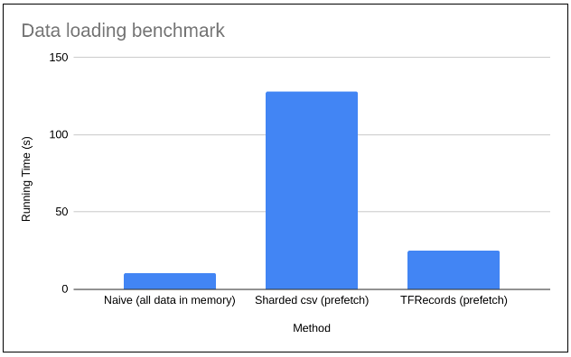

# TF DATA Benchmark

Benchmarking `tf.data` methods for training `tf.keras` models with tabular data.

## Methods

We (me and my cat 'Marie') benchmarked three data loading methods from tensorflow.

The machine specs we used in this task was:
* CPU: Core i5 7th gen
* RAM: 12GB DDR4 2133 MHz
* GPU: NVIDIA GeForce GTX 1050 4GB
* SSD: M.2

### Dataset

The dataset is artificially generated by `data_synthesizer.ipynb`

### Loaders

Naively loading data is certainly faster but it is not scalable. Therefore, we use it as a a baseline for comparison.

Prefetching datasets from the SSD into the RAM is scalable, as you can set the buffer size you desire. We used the default buffer size which falls back to using tensorflow's auto-tune to automatically determine the best value.

Three approaches are benchmarked:
* Naively loading all data in memory with pandas `train_naive.ipynb`
* Loading sharded `.csv` files and using `tf.data.experimental.make_csv_dataset`
* Loading the recommended tfrecords format `train_tf_data_tfrecords.ipynb`

## Results

The baseline approach took about 10s to train 5 epochs on 1000 batches of 1000 examples considering the time to load the data it took around 12 senconds total. Loading sharded `.csv` took about 128s to train and load, around 10x slower than the baseline. Loading sharded `TFRecords` files took only 25s to load and train the data, around 2x slower than the baseline and 5x faster than loading sharded `.csv`.

## Conclusion

Use `TFRecords`. It is possible to generate this file format locally, on `Apache beam` or `Apache Spark` and it will pay-off in the long run as your dataset scale to some orders of magnitude higher than your RAM size.

## Future work

For future benchmarks we map the following tasks:
* Optimizing the shard size for performance
* Benchmarking `tf.estimators` models

